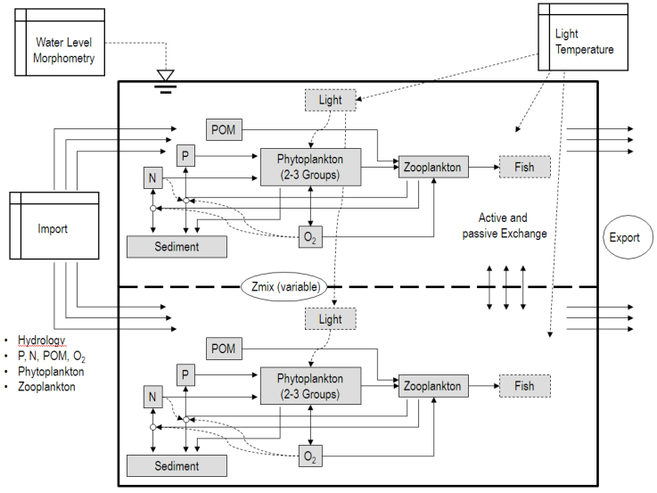

---
title: "  "
subtitle:  "Project rLimnoLab  and rSALMO"
author: "Thomas Petzoldt, <a href='http://tu-dresden.de/hydrobiologie'>TU Dresden, Germany</a>"
date: "2015-04-02"
output:
  html_document:
    keep_md: yes
---

<h3>Limnological systems laboratory in R</h3>

During the last years, plenty of ecological models have been developed
in the field of aquatic ecology, e.g. for rivers and lakes. However,
it occurred that tunnel-vision and re-inventing the wheel became main
hurdles for further progress (Mooij et al., 2010), but also the
Babylon of software systems and proprietary codes.

The aim of this project is to provide an experimental platform for
integrating existing model source codes, for further development at
the process level and for model comparisons between different
groups. We are currently working on an open source version of our own
lake model SALMO in form of an R package and released under the GPL.

<h3>The ecological lake model SALMO</h3>

The "Ecological Lake Model SALMO" (Simulation by means of an Analytical
MOdel) is a dynamic model, originally developed at TU Dresden, Institute
of Hydrobiology. It describes essential parts of the aquatic foodweb of lakes
and reservoirs.

The system of ordinary differential equations originates from the habilitation
thesis of Benndorf (1979) who modelled annual time-dependend development
of phytoplankton (two groups), zooplankton, oxygen, nutrients (N and P)
and external detritus of the water body, based on field observations and laboratory
experiments. First implementations in Fortran and HPL (Hewlett
Packard Language) have been developed by Recknagel (Recknagel, 1980;
Recknagel and Benndorf, 1982) and were used for numerous theoretical and
practical studies (e.g., Benndorf and Recknagel, 1979b,a, 1982; Benndorf
et al., 1985; Petzoldt and Recknagel, 1991). Since then, several versions,
implementations and spin-offs followed.

<h3>R package rSALMO</h3>

This R package aims to make an "almost original version" of the foodweb-part of the
model publicly available under the GPL 2 and to foster further development. Its source
code is derived from an independent implementation of the system of equations
of model version SALMO II (Benndorf, 1988). The JAVA version of
Dietze and Planke (Willmitzer et al., 1998) was then followed by the C version
SALMO-1D of Rolinski (Petzoldt and Siemens, 2002; Rolinski et al., 2005;
Petzoldt et al., 2005; Petzoldt and Uhlmann, 2006), that allowed coupling
to hydrophysical models such as LAKE (Baumert et al., 1989, 2005b,a) or
GOTM (Umlauf et al., 2007). During this time, the system equations underwent
fundamental generalisation (same equation for all seasons) and slow
but steady evolution.

Recently, Sachse et al. (2014) coupled SALMO-1D to a macrophyte module
based on the model PCLake (Janse and van Liere, 1995; Janse et al., 1998)
to simulate growth of and interaction effects with submersed water plants.
The code is now maintained by Thomas Petzoldt at TU Dresden, Institute
of Hydrobiology as a starting point for further developments. 

Note that all this is recent work in progress, so please contact me before trying
to run applications or investing your valuable work.

<h3>More information</h3>

* [rLimnoLab project page at R-Forge](http://r-forge.r-project.org/projects/rlimnolab/)
* [System of equations](salmo-equations.pdf) (work in progress)
* [SALMO Homepage](http://simecol.de/salmo)
* [deSolve project page](http://deSolve.r-forge.r-project.org)
* [TU Dresden, Institute of Hydrobiology](http://tu-dresden.de/hydrobiologie)
* [Homepage of the package author](http://tu-dresden.de/Members/thomas.petzoldt)

----

<h3>Funding</h3>

The recent developments where funded by the German Federal Ministry of Education 
and Research (BMBF) with grants FKZ:02WT0233 (Getas), FKZ:02WT0720 (IntegTA), 
FKZ:033L041E (NITROLIMIT) and by Deutsche Forschungsgemeinschaft within the AQUASHIFT 
priority program (DFG Pa 1202/1-2,3).

----
2015-04-02, ThPe

